CUDA Path Tracer
================

**University of Pennsylvania, CIS 565: GPU Programming and Architecture, Project 3**

* Gordon Kim
* Tested on: Windows 11, i7-12700 @ 2.10GHz 32GB, T1000 4GB (CETS Computer)

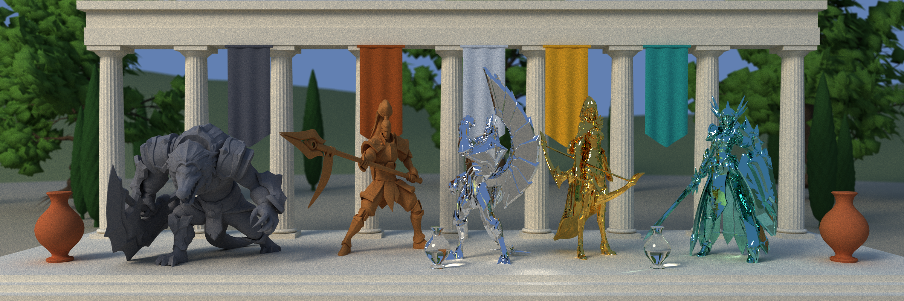

*Five League of Legends champions in materials matching the ranked tiers, iron to platinum. Left to right: Renekton (top, iron), Xin Zhao (jungle, bronze), Galio (mid, silver), Ashe (bot, gold) and Leona (support, platinum). 1,037,628 triangles, 2400×800.*

## Overview

A CUDA path tracer with diffuse, mirror and glass materials, thin-lens depth of field, and OBJ meshes accelerated by a per-mesh BVH. On the 15.7k-triangle teapot, the BVH makes intersection **36× faster** than brute force (2.3 s → 62 ms per iteration).

Every feature is a compile-time toggle in `src/features.h`.

### Features

**Shading and materials**
* [Diffuse, specular and mixed BSDFs](#bsdf-shading-diffuse-and-specular), plus a [mirror test on different shapes](#mirror-reflection-on-different-shapes)
* [Refraction](#refraction) with Schlick Fresnel and total internal reflection, compared across IORs 1.33–2.42
* [Direct lighting](#direct-lighting) on the last bounce

**Camera**
* [Stochastic antialiasing](#stochastic-antialiasing)
* [Thin-lens depth of field](#depth-of-field)

**Geometry**
* [OBJ mesh loading](#mesh-loading) with smooth or flat normals

**Performance**
* [BVH](#bvh-and-bounding-volume-culling): **4.3×** faster intersection on 948 triangles, **36.6×** on 15.7k, plus a [leaf size / max depth sweep](#tuning-leaf-size-and-max-depth)
* [Bounding-box culling](#bvh-and-bounding-volume-culling) for meshes
* [Stream compaction](#stream-compaction): **19%** faster in an open scene, 40% slower in a closed one
* [Russian roulette](#russian-roulette): **17%** faster open, **30%** closed
* [Sorting by material](#sorting-by-material): 66% slower on these scenes

## Gallery

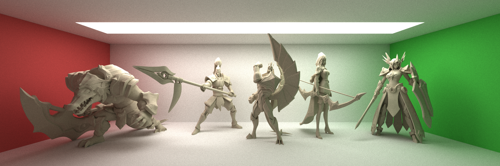

*The same five champions, all diffuse, in a Cornell box.*

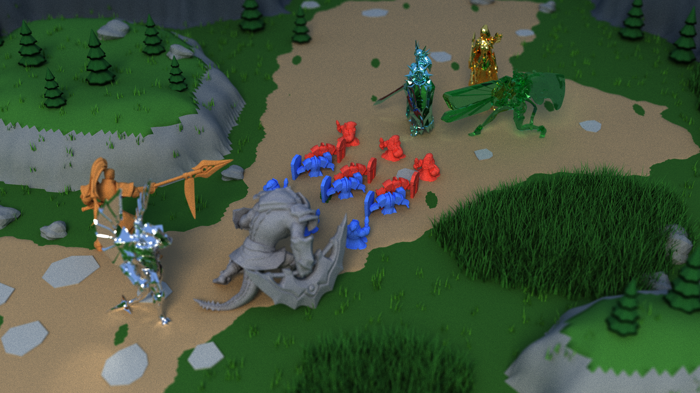

*Laning phase with minions and champions in diffuse, mirror, gold and glass materials, with depth of field. 1,451,983 triangles.*

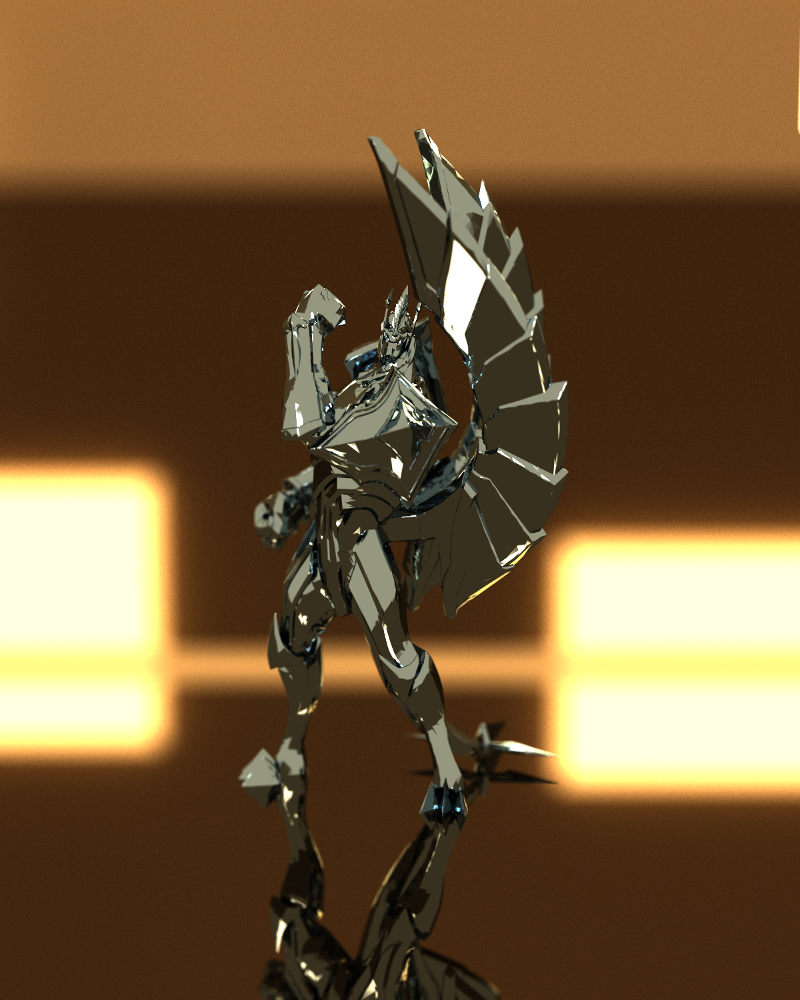

*Mirror Galio (150k triangles) with depth of field.*

## Scene File Additions

| Section | Key | Description |
|---|---|---|
| Material | `"TYPE": "Refractive"`, `"IOR"` | Glass material with index of refraction (default 1.5) |
| Object | `"TYPE": "mesh"`, `"FILE"` | Load an OBJ mesh from `scenes/objs/` |
| Camera | `"APERTURE"`, `"FOCAL_DIST"` | Lens radius and focus distance for depth of field |

## Build Changes

`CMakeLists.txt` was changed to add source files: `src/bvh.h`, `src/bvh.cpp`, `src/features.h`, `src/tinyobj.cpp`.

---

## Visual Features

### BSDF Shading (Diffuse and Specular)

`shadeMaterial` runs once per bounce and either ends the path or samples a new ray:

* **Diffuse:** cosine-weighted hemisphere sample. The cosine and pdf cancel, so throughput is multiplied by the albedo.
* **Specular:** `glm::reflect` about the normal, throughput multiplied by the specular color.
* **Mixed:** with `hasReflective` in (0, 1), pick specular with that probability, otherwise diffuse, and divide by the probability to stay unbiased.
* **Emissive:** multiply by color × emittance and end the path.

| Diffuse | Specular |
|---|---|
| 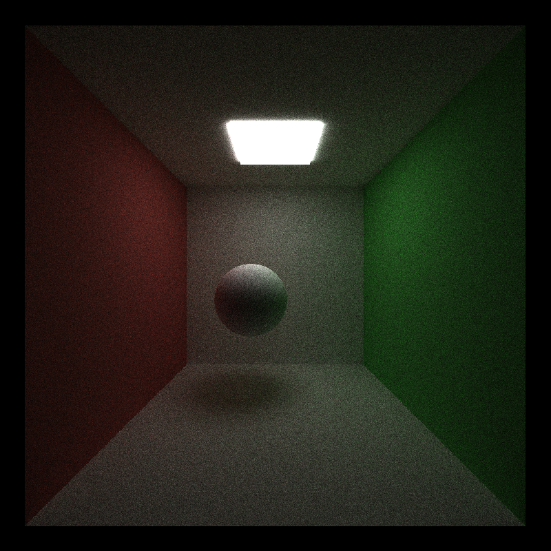 | 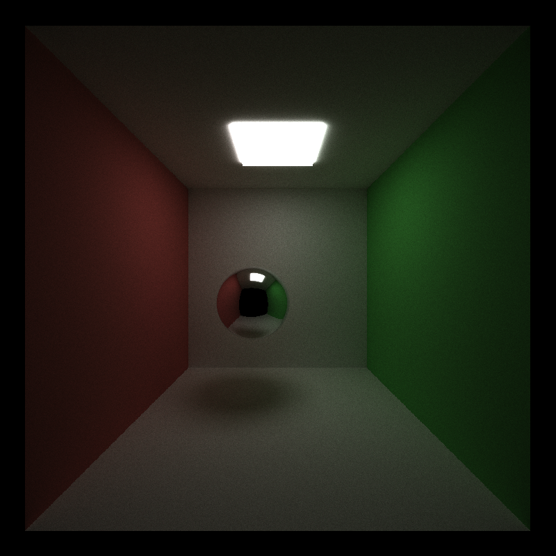 |

#### Mirror Reflection on Different Shapes

`scenes/reflection_shapes.json` has five mirrors in a closed room: a sphere, a cube, a tilted cube, a tetrahedron (OBJ) and the low-poly bunny (OBJ, 948 triangles). Small colored objects sit in the gaps so they show up in the mirrors on both sides, and a purple glass tetrahedron next to the orange cube shows refraction through a reflection. The back wall has vertical stripes and the wall behind the camera has horizontal ones, so you can tell which wall a reflection is showing.

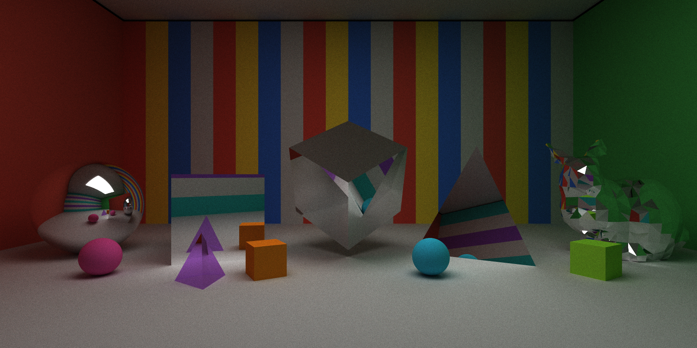

*Left to right: sphere, cube, tilted cube, tetrahedron, low-poly bunny.*

* **Sphere:** a wide-angle view of the whole room, including the wall behind the camera.
* **Cube / tilted cube:** each face is a flat, undistorted mirror. Tilting it makes the faces reflect the floor, ceiling and light.
* **Tetrahedron:** a few large facets, so the reflection breaks into sharp separate pieces.
* **Bunny:** the OBJ has no vertex normals, so it's flat-shaded and every facet reflects a different piece of the room.

The scene uses depth 10 so reflections between mirrors still reach the light.

**Limitation:** `"ROUGHNESS"` is parsed but not used, so all specular surfaces are perfect mirrors.

### Stochastic Antialiasing

With `ANTIALIASING` on, `generateRayFromCamera` jitters each camera ray by a random offset in [−0.5, 0.5) pixel, seeded by iteration and pixel index. Averaging iterations box-filters each pixel, so edges converge to a blend instead of a staircase. It costs two random numbers per ray and no extra rays, but it means the first bounce can't be cached across iterations. The effect is most visible on the reflection of the void on the specular sphere.

| Antialiasing off | Antialiasing on |
|---|---|
|  | 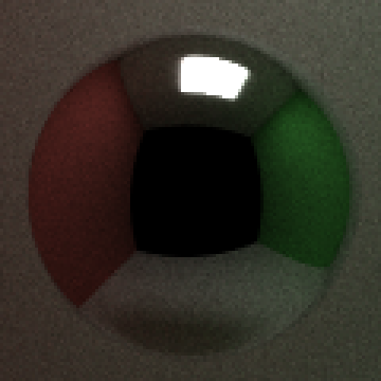 |

*120×120 crop of the mirror sphere, enlarged 4×.*

### Refraction

`"TYPE": "Refractive"` materials refract with Snell's law. At each hit the ray either reflects or refracts, with the Schlick Fresnel reflectance as the probability of reflecting.

* **Fresnel:** *R(θ) = R₀ + (1 − R₀)(1 − cos θ)⁵*, *R₀ = ((1 − n)/(1 + n))²*. When exiting, the transmitted angle's cosine is used.
* **Total internal reflection:** if sin²θₜ ≥ 1, always reflect.
* **Entering vs. exiting:** the intersection's outside flag picks 1/n or n.
* Refracted rays are offset below the surface (`REFRACTION_OFFSET`) to avoid self-intersection.

#### IOR Comparison

`scenes/refraction_ior.json`: the bottom row has IOR **1.33, 1.5, 1.77, 2.42**, and above each is an **IOR 1.5** control. The second column (1.5 over 1.5) should match, as a sanity check.

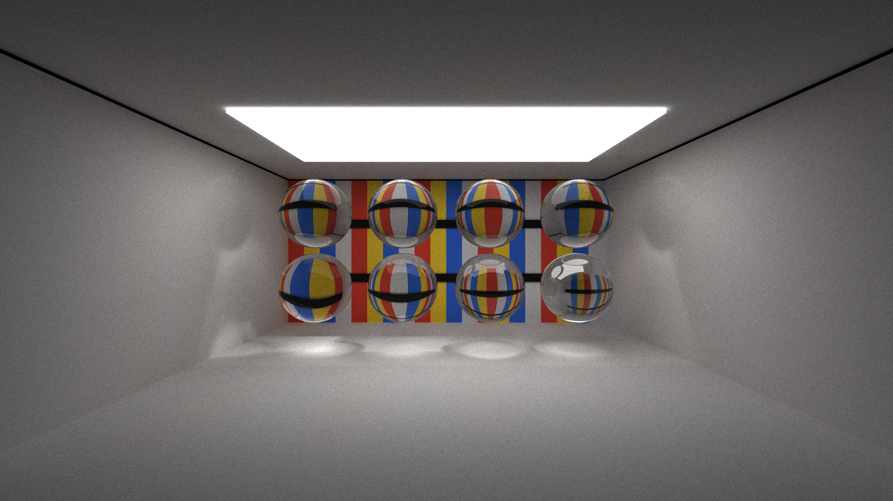

*Top row: IOR 1.5 (control). Bottom row, left to right: IOR 1.33, 1.5, 1.77, 2.42.*

Each sphere acts as a ball lens, so the wall behind it appears flipped.

| IOR | Focal length (from sphere center) | Head-on reflectance R₀ | Critical angle (inside) |
|---|---|---|---|
| 1.33 | 2.02 r | 2.0% | 48.8° |
| 1.5 | 1.50 r | 4.0% | 41.8° |
| 1.77 | 1.15 r | 7.7% | 34.4° |
| 2.42 | 0.85 r | 17.2% | 24.4° |

* **Magnification:** lower IOR means a longer focal length and a more magnified image. IOR 1.33 shows a few wide stripes; IOR 2.42 shrinks the whole pattern to the center.
* **Rim:** higher IOR has a smaller critical angle, so IOR 2.42 has a wide reflective rim.
* **Surface reflection:** R₀ goes from 2% to 17%, so only IOR 2.42 clearly reflects the light.

* **Acceleration:** picking one of reflect/refract per hit keeps one ray per path and a fixed-size path buffer, instead of splitting rays.
* **GPU vs. CPU:** the random reflect/refract branch diverges within warps, and glass paths take more bounces (depth 12 here), keeping threads busy after neighbors die. On a CPU it's just a branch.
* **Future optimization:** exact Fresnel equations instead of Schlick; Beer–Lambert absorption and dispersion; grouping glass paths so warps don't mix glass and diffuse.

### Depth of Field

Setting `"APERTURE"` (lens radius) in the camera switches to a thin-lens model. `"FOCAL_DIST"` sets the focus plane and defaults to the look-at distance. Toggle with `DEPTH_OF_FIELD`.

In `generateRayFromCamera`: find where the pinhole ray hits the focus plane (*t = focalDistance / (dir · view)*), pick a point on the lens disk (*r = R·√u*), and shoot from the lens point toward the focus point. Points on the focus plane stay sharp and everything else blurs over iterations.

*Scene: `scenes/senna.json`, aperture 0.4, focal distance 10. Pinhole image uses aperture 0. The focus is on Senna's body, so the cannon (closer to the camera) and the back wall blur.*

| Pinhole (aperture 0) | Thin lens (aperture 0.4, focal distance 10) |
|---|---|
| 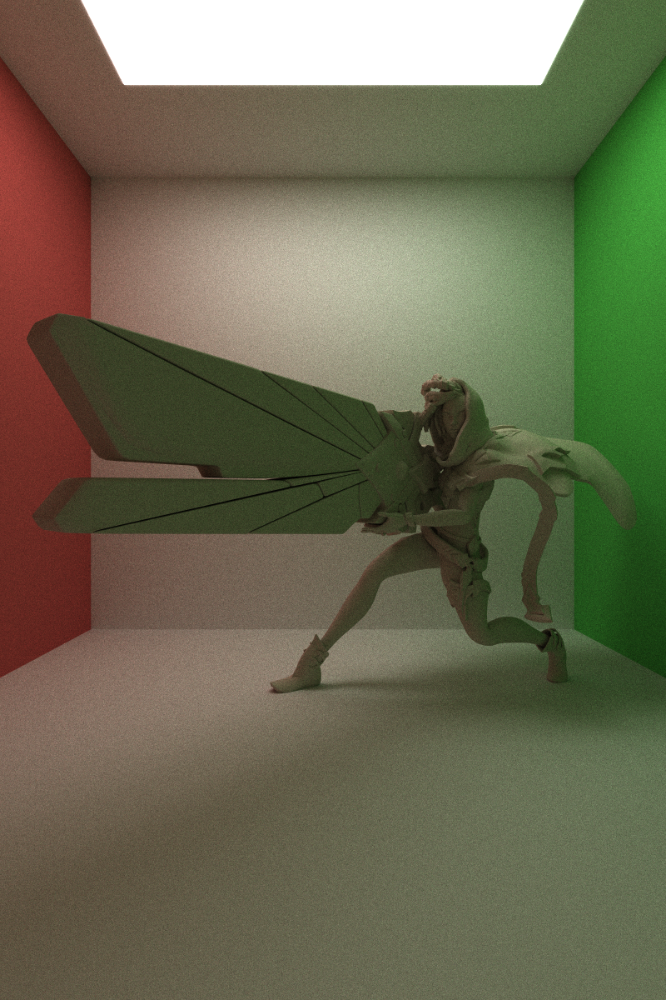 |  |

| Pinhole | Thin lens |
|---|---|
| 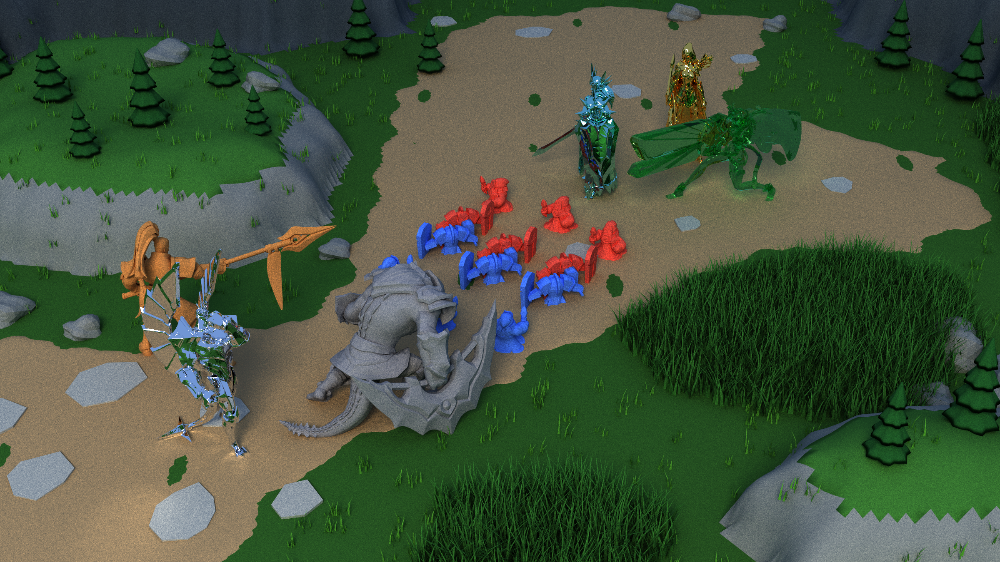 |  |

*Laning phase (1,451,983 triangles): the minions in the middle stay sharp while the foreground and background blur.*

* **Acceleration:** done inside the existing camera kernel, so no extra launches or rays. Blurred areas do take more iterations to converge.
* **GPU vs. CPU:** identical, branch-free per-pixel math, so it maps well to the GPU.
* **Future optimization:** stratified or low-discrepancy lens samples; polygonal apertures for shaped bokeh; autofocus from a center ray.

### Direct Lighting

With `DIRECT_LIGHTING` on, the last bounce of each path is aimed at a light instead of sampled from the BSDF:

1. On a diffuse hit with 2 bounces left, pick a random emissive cube and a random point on its bottom face (area *A = scale.x · scale.z*).
2. Send the next ray at that point. If something blocks it, the path ends dark, so it doubles as a shadow ray.
3. Weight by *(albedo / π) · cos θ_surface · cos θ_light · A · N_lights / d²*.

*Scene: `scenes/direct_lighting.json`, a closed room with one small 0.5 × 0.5 light, at depth 2 so only direct light is shown. Both images are at 100 iterations.*

| Direct lighting off | Direct lighting on |
|---|---|
| 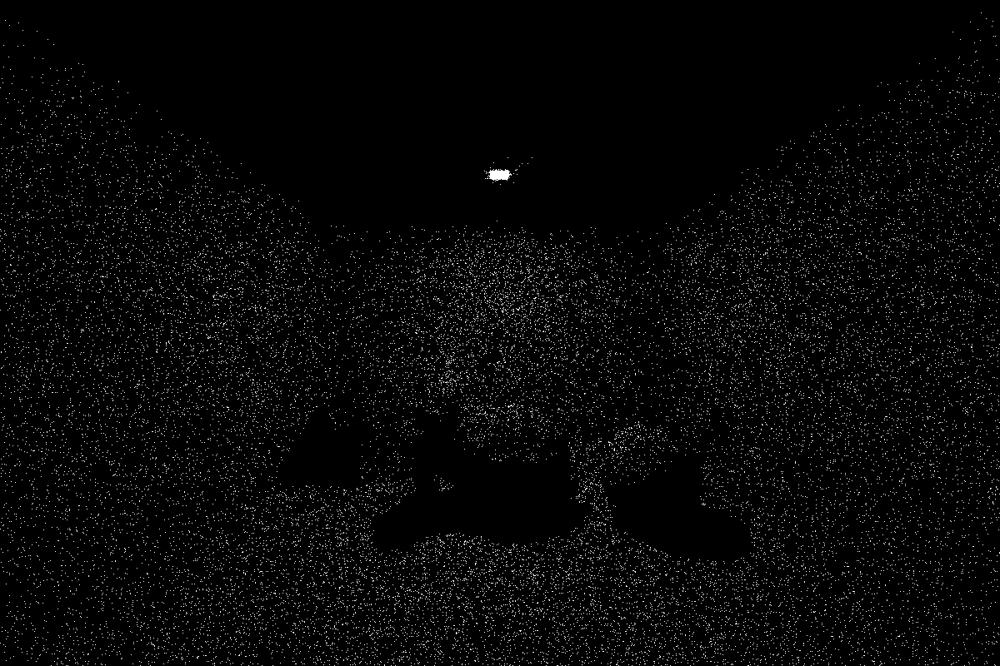 | 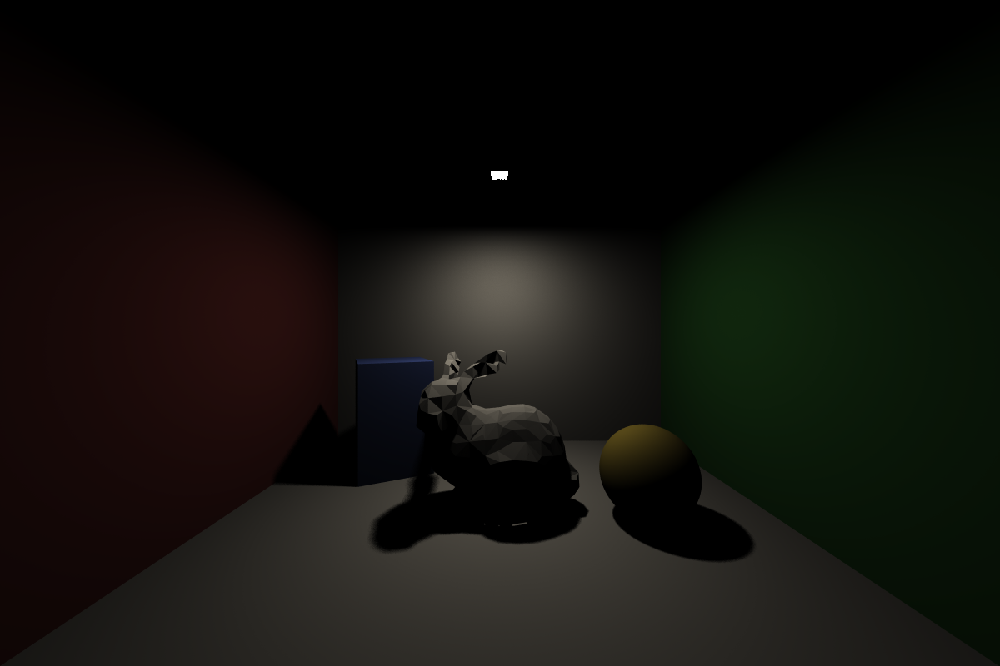 |

Without it, a pixel only lights up when its bounce randomly hits the tiny light, so the image is mostly black speckles. With it, every pixel that can see the light gets a sample and shadows show up right away.

* **Acceleration:** it redirects an existing bounce instead of adding a ray, so ms per iteration barely changes. The gain is in convergence.
* **GPU vs. CPU:** a separate shadow ray is cheap on a CPU, but on the GPU it would need another kernel and buffer. Reusing the next bounce avoids that.
* **Future optimization:** light sampling at every bounce with MIS; picking lights by power; support for non-cube lights.

### Mesh Loading

Objects with `"TYPE": "mesh"` and `"FILE"` load an OBJ from `scenes/objs/` using [tinyobjloader](https://github.com/tinyobjloader/tinyobjloader). They take the usual transforms and any material.

* **Loading:** faces are triangulated on load (the teapot's 8,028 faces become 15,704 triangles). All triangles go into one shared buffer in object space, and each mesh stores its range, bounding box and BVH root.
* **Normals:** if the OBJ has `vn`, normals are interpolated with barycentrics. Otherwise the face normal is used (flat shading).
* **Intersection:** the ray is transformed into object space once per mesh, tested with `glm::intersectRayTriangle` (via the BVH or brute force), and the hit is transformed back to world space. Front/back face is decided from the geometric normal so glass meshes refract correctly.

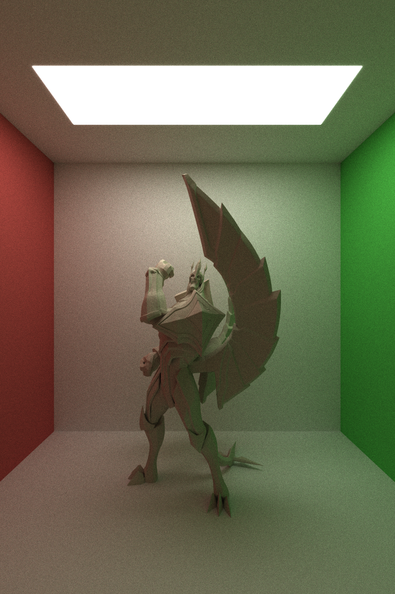

*Galio, 150,000 triangles, diffuse, in a Cornell box. 800×1200.*

* **Performance:** loading and BVH building happen once at startup. Render cost is all intersection: 2.3 s per iteration for the 15k-triangle teapot without a BVH. See [BVH](#bvh-and-bounding-volume-culling).
* **Acceleration:** transforming the ray instead of the triangles; one shared triangle buffer and BVH node buffer for all meshes.
* **GPU vs. CPU:** parsing and BVH building are serial and one-time, so they stay on the CPU. Intersection is millions of independent tests per iteration, which suits the GPU. At 72 bytes per triangle, memory access matters more than math.
* **Future optimization:** indexed vertices to shrink triangle data; instancing for repeated meshes; glTF for textures and materials.

---

## Performance Features

### Stream Compaction

After each bounce, `thrust::partition` moves terminated paths to the back of the buffer, and the next bounce only launches threads for live paths. Toggle with `STREAM_COMPACTION`.

To test how scene openness matters, `scenes/cornell_closed.json` extends the Cornell box past the camera and closes it with a front wall, so no ray can escape.

*Test config: default `features.h` with `RUSSIAN_ROULETTE 0`, `DIRECT_LIGHTING 0`, `SORT_BY_MATERIAL 0`. 800×800, depth 8.*

#### Paths Remaining per Bounce

Live paths after each bounce in one iteration (from `LOG_BOUNCE_COUNTS`):

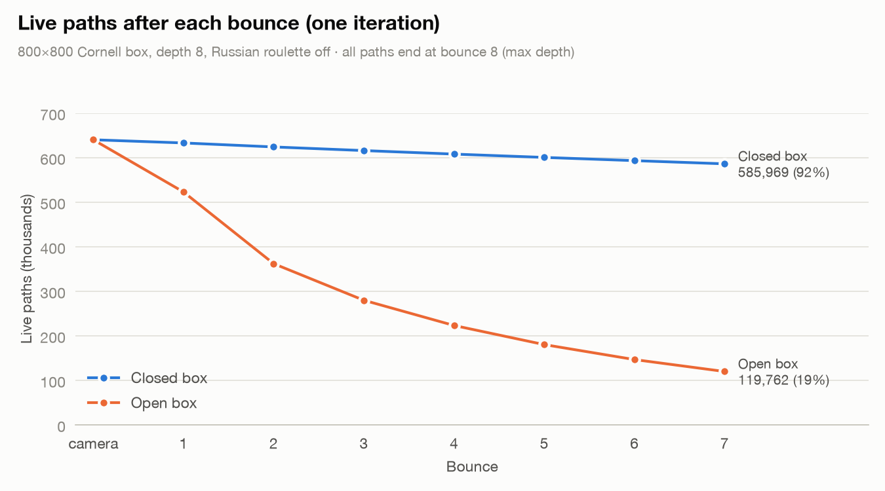

| Depth | Open scene | Closed scene |
|---|---|---|
| 0 (camera rays) | 640,000 | 640,000 |
| 1 | 522,808 | 632,848 |
| 2 | 361,801 | 623,902 |
| 3 | 279,652 | 615,728 |
| 4 | 223,090 | 607,822 |
| 5 | 180,170 | 600,372 |
| 6 | 146,551 | 593,151 |
| 7 | 119,762 | 585,969 |
| 8 | 0 | 0 |

In the open box, 19% of paths are still alive after bounce 7. In the closed box, paths can only die by hitting the light, so 92% are. Over an iteration, compaction cuts path-bounces from 5.12M to 2.47M (48%) in the open box but only to 4.90M (96%) in the closed one.

#### Open vs. Closed Scene

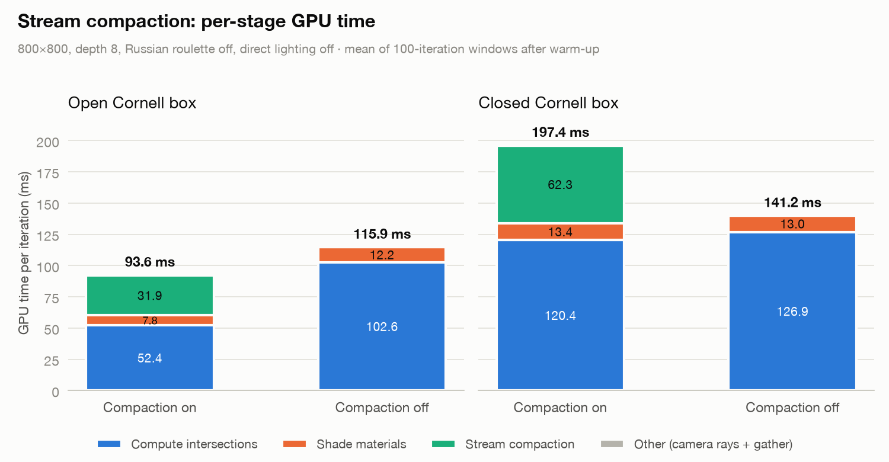

GPU time per iteration (ms). *Other* is camera ray generation plus final gather.

| Scene | Compaction | Intersect | Shade | Compact | Other | Total |
|---|---|---|---|---|---|---|
| Open | On | 52.4 | 7.8 | 31.9 | 1.5 | **93.6** |
| Open | Off | 102.6 | 12.2 | 0.0 | 1.1 | **115.9** |
| Closed | On | 120.4 | 13.4 | 62.3 | 1.3 | **197.4** |
| Closed | Off | 126.9 | 13.0 | 0.0 | 1.2 | **141.2** |

**Open: 19% faster.** Intersection drops 51%, matching the 48% of path-bounces left. The partition costs 31.9 ms but saves 54.6 ms of intersect and shade.

**Closed: 40% slower.** Almost every path survives, so intersection only drops 5%, while the partition costs 62.3 ms because it moves nearly all 640k paths every bounce. Shading also gets slightly slower since `thrust::partition` isn't stable and scrambles pixel order.

Compaction only pays off when enough paths die early. In closed scenes it needs Russian roulette to kill paths for it.

**Possible optimizations:**
* Partition an index array instead of full `PathSegment` structs.
* Skip compaction on bounces where few paths died.
* Use a stable partition to keep pixel order.

### Russian Roulette

After `RUSSIAN_ROULETTE_MIN_DEPTH` (3) bounces, a path survives with probability *p* = min(max(r, g, b), 1) of its throughput, and survivors are divided by *p* to stay unbiased. Toggle with `RUSSIAN_ROULETTE`.

*Test config: default `features.h` with `STREAM_COMPACTION 1`, `DIRECT_LIGHTING 0`, `SORT_BY_MATERIAL 0`. 800×800, depth 8.*

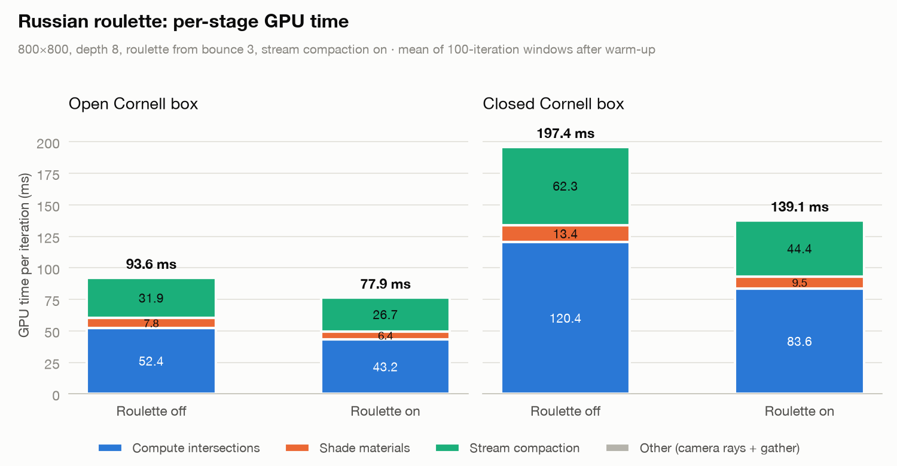

| Scene | Roulette | Intersect | Shade | Compact | Other | Total (ms) | Speedup |
|---|---|---|---|---|---|---|---|
| Open | Off | 52.4 | 7.8 | 31.9 | 1.5 | **93.6** | |
| Open | On | 43.2 | 6.4 | 26.7 | 1.5 | **77.9** | **17%** |
| Closed | Off | 120.4 | 13.4 | 62.3 | 1.3 | **197.4** | |
| Closed | On | 83.6 | 9.5 | 44.4 | 1.5 | **139.1** | **30%** |

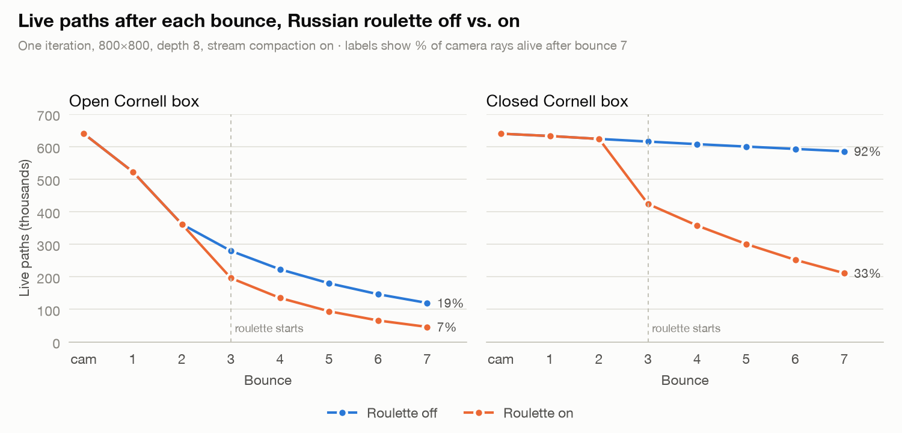

| Depth | Open, off | Open, on | Closed, off | Closed, on |
|---|---|---|---|---|
| 0 (camera rays) | 640,000 | 640,000 | 640,000 | 640,000 |
| 1 | 522,808 | 522,808 | 632,848 | 632,848 |
| 2 | 361,801 | 361,801 | 623,902 | 623,902 |
| 3 | 279,652 | 196,079 | 615,728 | 423,825 |
| 4 | 223,090 | 135,107 | 607,822 | 357,560 |
| 5 | 180,170 | 94,099 | 600,372 | 300,807 |
| 6 | 146,551 | 65,828 | 593,151 | 252,258 |
| 7 | 119,762 | 46,117 | 585,969 | 211,230 |
| Path-bounces per iteration | 2.47M | 2.06M (−17%) | 4.90M | 3.44M (−30%) |

| Roulette off | Roulette on |
|---|---|
| 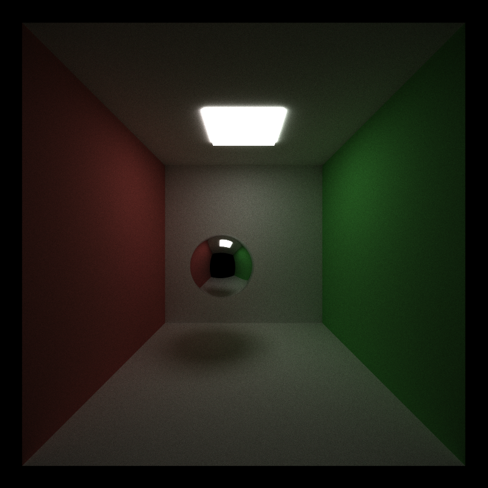 |  |

*The converged image looks the same with roulette on, since survivors are reweighted to keep it unbiased.*

* **Performance:** 17% faster open, 30% closed, matching the drop in path-bounces. The closed box gains more because almost nothing terminates there otherwise.
* **Acceleration:** roulette only saves time because compaction removes the killed paths. In the closed box, compaction alone was 40% slower than none, but compaction + roulette (139.1 ms) is about even with no compaction (141.2 ms).
* **GPU vs. CPU:** on a CPU a killed path just exits its loop. On the GPU dead threads are scattered across warps until compaction runs.
* **Future optimization:** tune the min depth; use luminance for the survival probability; cheaper compaction.

### Sorting by Material

Before shading, `thrust::sort_by_key` sorts intersections and path segments by material ID so warps take the same BSDF branch. Toggle with `SORT_BY_MATERIAL` (off by default).

*Test config: default `features.h` (`STREAM_COMPACTION 1`, `RUSSIAN_ROULETTE 1`, `DIRECT_LIGHTING 0`). Open Cornell box, 800×800, depth 8.*

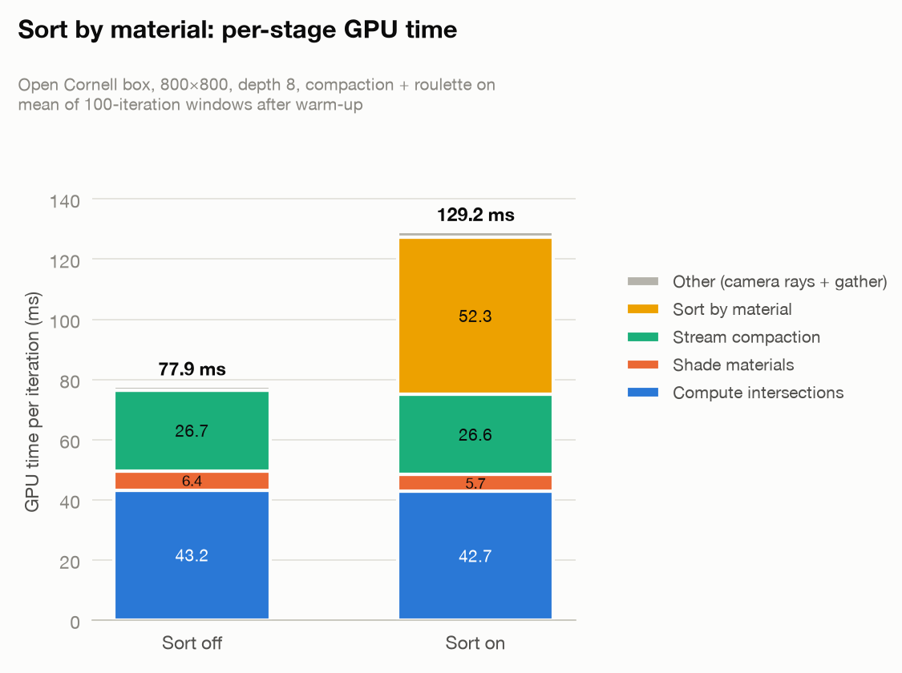

| Sort | Intersect | Sort | Shade | Compact | Other | Total (ms) |
|---|---|---|---|---|---|---|
| Off | 43.2 | 0.0 | 6.4 | 26.7 | 1.5 | **77.9** |
| On | 42.7 | 52.3 | 5.7 | 26.6 | 1.9 | **129.2** (+66%) |

**Sorting is 66% slower.** Shading does get 12% faster (6.4 → 5.7 ms), but it's only 8% of the frame, while the sort costs 52.3 ms. The Cornell box has five materials with cheap BSDFs, so there's little divergence to remove, and the sort moves two large structs per path every bounce. Material order also scatters the final gather's writes (0.62 → 1.06 ms). Sorting would make sense with many expensive materials (textures, layered BSDFs).

**Possible optimizations:**
* Sort (material ID, index) pairs instead of full structs.
* Use per-material queues and one shading kernel per material (wavefront path tracing).

### BVH and Bounding Volume Culling

Each mesh gets a BVH built on the CPU at load time and uploaded as a flat node array.
* **Construction:** split at the midpoint of the longest centroid axis, with a median split as fallback. Stop at `BVH_LEAF_SIZE` (4) triangles or `BVH_MAX_DEPTH` (32).
* **Traversal:** iterative with a fixed stack. Nearer child first, and nodes farther than the closest hit are skipped.
* **Bounding-box culling** (`BVH 0`, `MESH_BOUNDING_VOLUME_CULLING 1`): one AABB per mesh. Rays that hit it test every triangle.

| Scene | Triangles | BVH nodes | Leaves | Depth |
|---|---|---|---|---|
| `bunny_lowpoly` | 948 | 647 | 324 | 11 |
| `teapot_glass` | 15,704 | 10,191 | 5,096 | 18 |

*Test config: default `features.h` (`STREAM_COMPACTION 1`, `RUSSIAN_ROULETTE 1`, `DIRECT_LIGHTING 0`). Scenes use different resolutions and depths, so compare within a scene.*

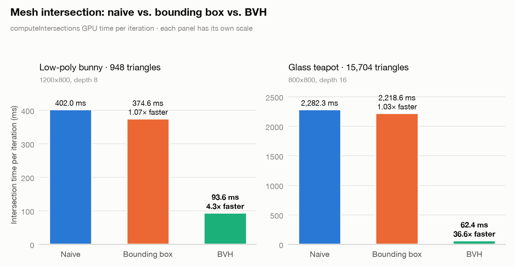

GPU time per iteration (ms):

| Scene | Triangles | Config | Intersect | Total | Intersect speedup | Total speedup |
|---|---|---|---|---|---|---|
| `bunny_lowpoly` | 948 | Naive | 402.0 | 485.8 | | |
| | | Bounding box | 374.6 | 457.5 | 1.07× | 1.06× |
| | | BVH | 93.6 | 175.9 | **4.3×** | **2.8×** |
| `teapot_glass` | 15,704 | Naive | 2,282.3 | 2,327.7 | | |
| | | Bounding box | 2,218.6 | 2,263.1 | 1.03× | 1.03× |
| | | BVH | 62.4 | 104.5 | **36.6×** | **22.3×** |

* **Performance:** 4.3× on the bunny and 36.6× on the teapot. Naive cost grows linearly with triangle count while the BVH grows roughly with log n. Sponza was too slow to measure without it.
* **Bounding box alone** only helps 3–7%, since both meshes fill much of the frame and rays that enter the box still test every triangle.
* **GPU vs. CPU:** each thread traverses independently, so neighboring rays diverge and read scattered nodes. That's still far cheaper than O(n) per ray.
* **Future optimization:** SAH splits; stackless traversal and smaller nodes; one top-level BVH over all geometry; sorting rays by direction.

#### Tuning Leaf Size and Max Depth

`BVH_LEAF_SIZE` stops splitting at that many triangles. `BVH_MAX_DEPTH` forces a leaf at that depth and sizes the traversal stack. Swept on Galio (150k triangles, 800×1200, depth 8), one at a time.

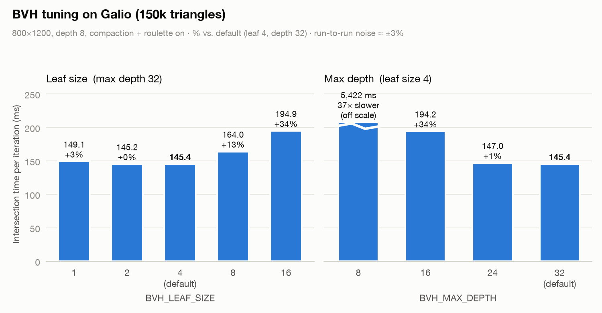

| Leaf size (max depth 32) | Nodes | Leaves | Tree depth | Intersect (ms) | vs. default |
|---|---|---|---|---|---|
| 1 | 299,799 | 149,900 | 32 | 149.1 | +3% |
| 2 | 189,355 | 94,678 | 32 | 145.2 | ±0% |
| **4** | 107,535 | 53,768 | 32 | **145.4** | — |
| 8 | 58,179 | 29,090 | 30 | 164.0 | +13% |
| 16 | 30,603 | 15,302 | 29 | 194.9 | +34% |

| Max depth (leaf size 4) | Largest leaf | Intersect (ms) | vs. default |
|---|---|---|---|
| 8 | 12,441 triangles | 5,422 | 37× slower |
| 16 | — | 194.2 | +34% |
| 24 | 74 triangles | 147.0 | +1% |
| **32** | 4 triangles | **145.4** | — |

*Times drift 3–4% over a run as the GPU heats up, so smaller differences are noise.*

* **Leaf size:** 1–4 are about the same; below 4 the extra box tests cost as much as the triangle tests they save. Above 4, cost climbs (+13% at 8, +34% at 16).
* **Max depth:** only matters when it truncates the tree. At 8, the largest leaf has 12,441 triangles, which is close to brute force. 24 and 32 perform the same.
* The defaults (4, 32) are at the optimum.

---

## Credits

* [tinyobjloader](https://github.com/tinyobjloader/tinyobjloader) for OBJ loading
* [Stanford 3D Scanning Repository](https://graphics.stanford.edu/data/3Dscanrep/) for the bunny
* [McGuire Computer Graphics Archive](https://casual-effects.com/data/) for Sponza, the teapot and the white oak
* Free champion models from [CGTrader](https://www.cgtrader.com/), downloaded as STL and converted to OBJ
* [PBRTv4](https://pbr-book.org/4ed/contents)
